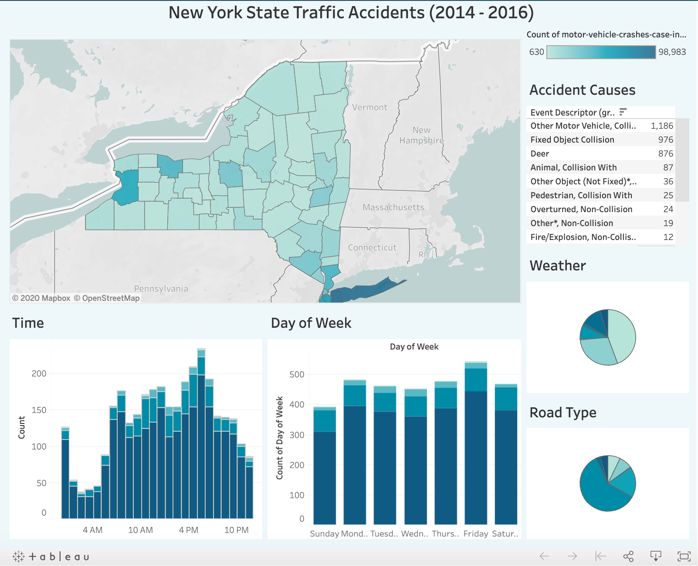

# Crash-Severity-Classifier

**Data science project built using New York State DMV data to predicts crash severity.**

In this repo you will find the following files:
* [My powerpoint presentation](https://github.com/S-DeFerrari/Crash-Severity-Classifier/blob/master/Predicting%20Crash%20Severity%20in%20New%20York%20State%20(1).pdf) on this project going over each step of the process as well as my results. This is the best place to start. 
* A jupyter notebook covering the project's [feature engineering.](https://github.com/S-DeFerrari/Crash-Severity-Classifier/blob/master/Project%203%20Engineering.ipynb)
* A jupyter notebook where I created the feature covering each [county's impaired driving rate.](https://github.com/S-DeFerrari/Crash-Severity-Classifier/blob/master/Data%20Wrangling%20-%20Counties%20Impaired.ipynb)
* A jupyter notebook covering the project's [modeling.](https://github.com/S-DeFerrari/Crash-Severity-Classifier/blob/master/Project%203%20-%20Modeling.ipynb)

[The data](https://www.kaggle.com/new-york-state/nys-motor-vehicle-crashes-and-insurance-reduction) used in this project comes from Kaggle and was originally uploaded by the State of New York. 

## Tableau Dashboard 

Please take a look at the [dashboard](https://public.tableau.com/profile/stephen.deferrari#!/vizhome/Project3_15965979112260/Dashboard1) I made for this project as well. 

Thank you for looking through my work, let me know if you have any comments or questions.
